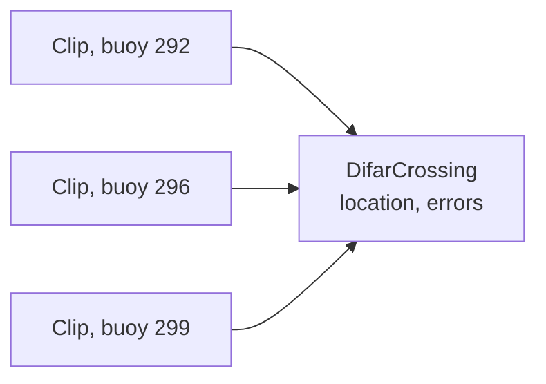

# DIFAR crossings as super-detections

Brian Miller, Australian Antarctic Division. 25 September 2026.

## Summary

A DIFAR crossing is a relationship between clips. Today it is stored inside each clip, as the crossing that stood when that clip was saved. On load, the reader rewires earlier clips to the latest crossing. So a clip's stored record depends on what else is loaded, and reading and rewriting a clip can lose its partners.

This note proposes storing each crossing as its own data unit: a super-detection whose sub-detections are its clips. PAMGuard already uses this pattern for detection groups and for the group 3D localiser. Clips would carry only their own bearing. Crossings would name their clips by UID and live in the database, in their own table and subtable, as other super-detections do.

New files would use a new module version. Old files would still be read, with each old crossing converted to a crossing unit as it loads.

## How crossings are stored today (the problem)

Each clip carries a `DIFARCrossingInfo`: a cross location, two errors, and an array of matched clips with the clip itself first. The crossing is built in `DifarProcess.applyMatch` and held as a temporary crossing on the new clip and on each partner. When the new clip is saved, `DifarDataUnit.saveCrossing` makes it permanent on all of them.

In normal mode only the new clip is written, since its partners are already in earlier files. So each file keeps the crossing as it stood when that clip was saved. In the 2013 pilot, three clips of one call hold crossings with 1, 2 and 3 members. One triangulation appears three times, which is why counting triangulations was never just counting matches.

The binary payload names partners by channel and time, not UID. On read, `DifarBinaryDataSource.sinkData` does two things beyond decoding:

1. It looks up each partner with `findDataUnit(time, channel)` in the loaded block. A partner that is not loaded becomes null and is dropped without a message.
2. It calls `setDifarCrossing` on every partner it finds, so earlier clips in memory are rewired to the latest crossing.

On write, `getPackedData` counts only non-null partners. So any read followed by a write can lose partners, and what a clip holds in memory depends on load order. The viewer compactor hit this on its first real test: two clips lost their partner links when rewritten. The core viewer save has the same exposure for any changed clip whose partner lies outside the loaded window.

The database has the same shape. `DifarSqlLogging` writes each clip's crossing location and a string of partner UIDs into the clip's own row.

## PAMGuard's existing pattern

PAMGuard models a group of detections as a super-detection, in `PamguardMVC.superdet`. The pieces DIFAR would use:

| Class | What it does |
| --- | --- |
| `SuperDetection<T>` | A data unit that holds a list of `SubdetectionInfo` records, one per child. |
| `SubdetectionInfo` | Names a child by UID, UTC time and data block name, and holds the child object once it is loaded. |
| `SuperDetDataBlock` | Holds super-detections. In the viewer, `reattachSubdetections` links each record to its loaded child by UID. `LOAD_OVERLAPTIME` loads any group overlapping the window. |
| `SuperDetLogging` | Logs a super-detection to its own table, and its children to a subtable of parent UID, child UID and child time. |
| `SubDetectionLoader` | Reads children outside the loaded window straight from the binary files, by time, without touching loaded data. |

The links persist through the database subtable. The children stay in their own binary files, unchanged. A child never records which groups it belongs to.

The closest template is the detection group localiser. `DetectionGroupDataUnit`, `DetectionGroupDataBlock`, `DetectionGroupLogging` and `DetectionGroupSubLogging` make a group of detections, store it with its children in a subtable, and attach a target-motion localisation to the group. DIFAR crossings would follow its classes closely. The group 3D localiser's `Group3DDataUnit` and `Group3DLogging` are a second example.

The crossed-bearing localiser is not a template, despite the similar problem. Its `CBMatchGroup` is a super-detection used only in memory for matching. Its result is stored as an annotation on the newest detection, which is the same shape as DIFAR today.

## Proposed design (the solution)

A crossing becomes a `DifarCrossing`, a `SuperDetection<DifarDataUnit>`. Its children are the clips that were crossed. A clip holds only its own bearing, frequency, audio and species.

Each clip points to the crossing through the usual super-detection link in memory. Nothing about the crossing is written into the clip.

**The crossing unit.** It carries its own UID, the cross latitude and longitude, the x and y errors, the xyz vector, and the number of clips. Its start is the earliest clip and its end the latest clip end, so `LOAD_OVERLAPTIME` brings it in whenever any of its clips is in the window. Its channel map is the union of its clips' channels.

**The data block.** `DifarCrossingDataBlock` extends `SuperDetDataBlock<DifarCrossing, DifarDataUnit>`, owned by `DifarProcess` beside the queue and the saved clips.

**The database.** `DifarCrossingLogging` extends `SuperDetLogging`. It writes a `DIFAR_Crossing` table, one row per crossing, and a subtable with one row per clip giving the crossing UID, the clip UID, the clip time and the clip's binary file name, as every PAMGuard subtable does. Matching checks time first, then UID, and falls back to the file name if a UID is corrupt. The subtable also carries each clip's channel, buoy name and true bearing, so one query returns a crossing with everything needed to plot it. Viewer compaction moves clips between files, so it must update the file name in these rows. The partner UID string leaves the clip table.

**No binary stream for crossings.** PAMGuard's other super-detections keep their links only in the database, and DIFAR follows them. Clips stay in their own binary files. A setup with no database keeps its clips and bearings, but not its crossings.

**The clip payload.** A new module version drops the crossing tail. Packing and unpacking a clip then touch nothing but that clip.

**One crossing per clip.** A clip is one acoustic event, so it belongs to at most one crossing. A new crossing claims its clips. Any crossing that shares a clip with it loses that clip, and is recalculated if two or more clips remain, or deleted otherwise. The setting for deleting clips applies here too. When a third buoy extends a two-buoy crossing, nothing remains of the old one, so one crossing remains, not two. Re-matching one clip of a three-buoy crossing leaves the other two to be recalculated.

**Keeping call sites small.** `DifarDataUnit.getDifarCrossing()` stays, returning the one crossing the clip belongs to, or null. Displays, localisation and target motion keep working through it at first, and can move to the crossing block later.

## Normal mode

The operator sees no change. Matching, the match selector and the save keys work as now.

1. **Matching.** `getDifarRangeInfo` and `applyMatch` build a candidate crossing as now. It becomes a `DifarCrossing` held by `DifarProcess` as the pending crossing for the clip being worked. It is not in any data block yet. The map overlay draws it as it draws the temporary crossing today.
2. **Save.** The clip joins the saved clips and gets its UID. Then the pending crossing takes its clips and joins the crossing block, which writes it to the database. `saveCrossing` and the temporary crossing on each clip go.
3. **Save without range.** The clip is saved and the pending crossing is dropped.
4. **Replacing.** On save, the new crossing claims its clips from any earlier crossing, as in the design above.

**Buoy edits.** A clip's binary object holds only what was measured: time, channel, and the bearing relative to the buoy. The buoy's position and heading are looked up when needed, so a buoy edit never changes a clip's binary object. The clip's database row is different. It also stores the buoy latitude, longitude and heading and the true bearing, all derived from the buoy at save time. After a buoy edit, `SonobuoyManager` recalculates each affected crossing and updates the derived columns of each affected clip row. The binary files are the record of what was measured, and the database is the ready-to-use view, kept current.

**Which buoy.** A clip's channel and time already identify its sonobuoy deployment, since a channel holds one deployment at a time. But finding it in SQL means joining on a time range, and end times are often missing. So clip rows also store the deployment's name and its UID. The name carries the operators' own convention, such as the decimal suffix used when a physical buoy moves to a new channel. A physical buoy identity across deployments belongs in the buoy manager, and is outside this work.

**Displays and localisation.** `DifarOverlayGraphics` and `DifarLocalisation` read the crossing through `getDifarCrossing()` at first. `DifarDataSelector` filters on it the same way.

**Target motion.** `DIFARTargetMotionInformation` takes a list of clips already. Nothing changes.

**Tracked groups.** `TrackedGroupCrossingInfo` is a separate copy of the same idea, built from tracked groups. It reads clip crossings through `getDifarCrossing()`, so it keeps working. Tracked groups are old and unused, and are likely to be dropped or replaced by a general tracking tool later. This work leaves them alone.

## Viewer mode

**Loading.** Clips load from their binary files as now, with nothing to resolve. Crossings load from the database with `LOAD_OVERLAPTIME`, so any crossing touching the window comes in. `reattachSubdetections` then links each crossing to its loaded clips by UID. A crossing whose clips lie partly outside the window still has its location, errors and clip list. When a tool needs the missing clips, `SubDetectionLoader` reads them from the binary files by time without changing what is loaded.

**Re-triangulating.** Marking and saving a new clip works as in normal mode: its crossing is a new unit, claiming its clips from any earlier crossing. Rechecking a saved clip's match makes a new crossing the same way. No existing clip is rewritten.

**Deleting a clip.** By default, the crossing that contains it is recalculated from its remaining clips if at least two are left, and deleted otherwise. A DIFAR setting switches this to always deleting the crossing, for operators who prefer to redo it by hand. The clip's database row, its subtable rows and its binary object all go at the next save.

**Compaction.** Only clips have binary files, so only clips are compacted, using the time grid, closure and merge by UID already written. Compaction becomes lossless, because unpacking a clip no longer looks up or changes other clips. The core in-place save becomes safe for changed clips for the same reason. Crossings are database rows, added, updated and deleted directly.

## Reading old files

DIFAR clips are at module version 2. New clips are written at version 3, with no crossing tail. Versions 0 to 2 are still read.

**On read.** For versions up to 2, the reader decodes the crossing tail into a plain legacy record on the clip: location, errors, and each partner's channel and time. It does no lookups and changes no other clip.

**Building crossings.** After a load, a conversion step turns legacy records into `DifarCrossing` units in memory:

1. Partners are found by channel and time among the loaded clips, then in the binary files through the same time lookup `SubDetectionLoader` uses.
2. Records are replayed in the order they were saved, each claiming its clips as a new crossing does now. In the pilot, records of one, two and three clips become one crossing of three. A record with fewer than two clips is dropped with a warning. A crossing that later records took clips from is recalculated.
3. Where the old clip table has partner UIDs in `MatchedAngles`, they confirm the match.

These crossings exist in memory only. The viewer shows them as before, and nothing is written.

**Converting a dataset.** An offline task runs the same conversion over a whole dataset and writes the crossing tables once. After that, legacy records are ignored. Old clip files are never rewritten by the conversion.

**The clip table.** New clip rows leave `Latitude`, `Longitude`, `XError`, `YError` and `MatchedAngles` as NULL, the database's own mark for no value. The columns stay only so old databases still open. Old datasets are converted to the new format and read with new tools. No new tool reads the old columns.

## What changes where

Everything stays inside `src/difar`. No core class changes.

| Class | Change |
| --- | --- |
| `DifarCrossing` | New. The crossing super-detection. |
| `DifarCrossingDataBlock` | New. `SuperDetDataBlock` with `LOAD_OVERLAPTIME`. |
| `DifarCrossingLogging` | New. `SuperDetLogging` with its clip subtable, including channel, buoy name and true bearing. |
| `DifarBinaryDataSource` | Version 3 without the crossing tail. Versions 0 to 2 read into a legacy record. |
| `DifarDataUnit` | Drops the temporary crossing and `saveCrossing`. `getDifarCrossing()` returns the clip's crossing. |
| `DifarProcess` | Holds the pending crossing and the crossing block. `applyMatch` builds a `DifarCrossing`. |
| `DifarControl` | Save adds the pending crossing to the block. |
| `DifarParameters` | New setting: recalculate or delete crossings when a clip is deleted. |
| `DifarSqlLogging` | Writes NULL to the old crossing columns. Adds buoy name and deployment UID columns. |
| `SonobuoyManager` | Recalculates crossings and the derived columns of clip rows. Never rewrites clip binary objects. |
| `UpdateCrossingTask` | Rebuilds crossings from clips. |
| `ClearCrossingTask` | Deleted, as it is unused. |
| `DIFARCrossingInfo` | Deleted once every caller has moved. |

**Pure logic with JUnit.** Two pieces need no PAMGuard runtime: the claiming rule (which crossings a new one takes clips from, and what each keeps), and the legacy replay (old records claiming clips in save order). The clip payload round trip gets a test too. The existing DIFAR tests keep running throughout.

**Work order.** Each step compiles and runs on its own.

1. Pure classes and tests for the claiming rule and legacy replay.
2. `DifarCrossing`, its block and its logging.
3. Normal mode writes crossing units alongside the old crossing on each clip: claiming, recalculation, match choice. Then the simulated two-buoy regression check.
4. Clip payload version 3, and the legacy record for older versions. Buoy edits recalculate crossing units.
5. Viewer: load, reattach, in-memory conversion. Displays move to crossing units, and the old crossing on each clip is deleted.
6. The offline conversion task, tried on a copy of the pilot.
7. Viewer compaction for clips, then delete with its setting.

## Decisions

1. **Database only.** Crossings follow PAMGuard's other super-detections and have no binary stream.
2. **One crossing per clip.** A clip belongs to one crossing, since it is one event. A new crossing claims its clips, and a grown crossing replaces the smaller one. Keeping both would add confusion and accounting.
3. **Deleting a clip.** Recalculate its crossing when two or more clips remain, else delete it. A setting switches to always deleting.
4. **Old clip columns.** New rows write NULL. Old datasets are converted, not read by old-format tools.
5. **Tracked groups.** Left alone for now. They are likely to be dropped or replaced by a general tracking tool later.
